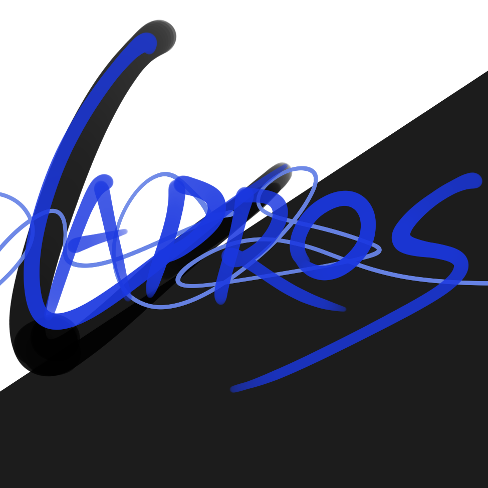

# 卡普洛斯的33个幻想：永无止境的雨与无止境边界的行者



一个沉浸式 roguelike 卡牌游戏，使用 Godot 引擎开发。在这个由神之幻想构建的世界中，玩家将扮演"行者"，穿梭于卡普洛斯的33个幻想之间。

## 世界观设定

### 核心概念
这个世界原本是一个平常的现实世界，直到**卡普洛斯**做了33个幻想。这些幻想创造了：
- 邪恶的生物与卡牌精灵
- 永无止境的雨
- KBC空洞的大幅缩减
- 每天下着流星雨的天空
- 巨大的地下城
- 以及更多超自然现象

### 游戏身份
玩家扮演**"无止境边界的行者"**，在卡普洛斯的精神图景中跋涉，收集"幻想的碎片"（卡牌），与堕落的行者、失控的幻想碎片作战。

### 核心机制解释
- **卡牌**：卡普洛斯散落的思绪、记忆和想象力的具象化
- **战斗**：幻想稳定性的对抗，用你的幻想去覆盖、改写对手的幻想
- **肉鸽路线**：穿梭于33个不同幻想场景之间的路径
- **圣地系统**：多个幻想交织的"共识点"，抢夺圣地意味着掌握区域的叙事主导权

## 核心特性

### 角色创建系统
- **属性分配**：体力（生命值）、精神（费用上限）、敏捷（先手概率/手牌上限）、智力（法术费用减免）
- **背景选择**：经历、理想、挫折、隐秘之事、喜欢的名著、初始携带物品
- **CRPG风格**：Low点数分配 + 自由选择点，每个选择都有独特的游戏性影响

### 战斗与卡牌系统
- **回合制卡牌战斗** - 完整的回合流程控制（抽卡、准备、主要、战斗、结束阶段）
- **卡牌组件/组装系统** - 独特的卡牌组装机制，允许玩家自定义卡牌
- **召唤系统** - 支持多种召唤方式（通常召唤、上级召唤、特殊召唤、额外召唤）
- **圣地争夺** - 独特的额外区域系统，影响资源获取和特殊效果

### 肉鸽与成长
- **33个幻想区域** - 每个区域都有独特的视觉主题、专属卡牌和遭遇事件
- **遗物系统** - "具有强大力量的幻想残骸"，提供被动增益
- **角色成长** - 通过冒险获得永久性提升和新的能力

### 视觉与氛围
- **朋克风格UI** - 洋红/黑/白配色，棱角分明的矩形设计
- **动态背景** - 雨滴、流星、地下城轮廓，营造沉浸式氛围
- **故障艺术** - UI元素带有信号干扰效果，体现世界的不稳定性

## 技术架构

```
res://
├── game/                    # 主游戏代码和资源
│   ├── entities/            # 游戏实体（卡牌、玩家等）
│   │   ├── components/      # 组件相关实体
│   │   └── relics/          # 遗物相关实体
│   ├── systems/             # 核心系统
│   │   └── battle/          # 战斗子系统
│   ├── managers/            # 管理器类
│   ├── ui/                  # UI相关脚本
│   ├── scenes/              # 场景文件
│   └── resources/           # 游戏资源文件
├── cards/                   # 卡牌定义文件
├── assets/                  # 游戏资源（图像、音频等）
└── docs/                    # 项目文档
```

## 当前实现状态

### 已完成
- **基础战斗系统**：玩家属性、回合流程、召唤系统、战斗机制
- **场地管理**：前场、后场、额外区域（圣地）系统
- **卡牌系统**：基础卡牌效果、组件化机制
- **UI框架**：朋克风格主菜单、矩形块布局、动态效果
- **地图系统**：类杀戮尖塔的节点式地图生成

### 开发中
- **角色创建系统**：属性分配、背景选择、CRPG风格角色构建
- **33个幻想区域**：独特场景设计、专属卡牌、遭遇事件
- **圣地争夺机制**：完整的额外区域战斗和效果系统
- **遗物系统**：幻想残骸收集和被动增益
- **音效与氛围**：雨声、雷鸣、故障音效

### 计划中
- **完整剧情**：卡普洛斯的33个幻想详细设定
- **更多卡牌类型**：基于世界观的新卡牌设计
- **多人模式**：行者之间的幻想对抗
- **MOD支持**：允许玩家创建自定义幻想区域

## 项目问题说明

项目中包含一些第三方代码（如 `godotCardParallax-*` 目录），这些代码可能存在兼容性问题或语法错误，因为它们是为旧版本Godot编写的。我们主要关注的是 [game/](file:///D:/Second/sen/game/scenes/TestBattle.tscn) 目录下的核心功能实现。

## 如何运行

1. 下载并安装 [Godot 4.x](https://godotengine.org/)
2. 克隆或下载此项目
3. 在Godot中打开项目
4. 运行项目

## 幻想区域预览

### 已规划的区域
- **永雨之都**：被永无止境的雨笼罩的城市，雨滴中蕴含着魔法力量
- **流星荒原**：每天下着流星雨的荒原，流星碎片可制作强力卡牌
- **KBC空洞回廊**：现实结构的bug区域，充满危险但藏有珍贵遗物
- **沉没图书馆**：卡普洛斯知识的具象化，可学习新的法术和策略

### 圣地类型
- **共鸣圣地**：多个幻想重叠的区域，规则最为稳固
- **破碎圣地**：不稳定的幻想碎片，效果随机但强大
- **记忆圣地**：卡普洛斯重要记忆的具象化，提供独特增益

## 开发路线图

### 第一阶段：核心系统
- [x] 基础战斗框架
- [x] UI设计语言
- [ ] 角色创建系统
- [ ] 圣地争夺机制

### 第二阶段：内容扩展
- [ ] 前5个幻想区域
- [ ] 基础遗物系统
- [ ] 角色背景系统
- [ ] 音效与氛围

### 第三阶段：深度内容
- [ ] 完整33个幻想区域
- [ ] 高级遗物与组合
- [ ] 剧情模式
- [ ] 平衡性调整

## 项目文档

- [设计文档](DESIGN_DOC.md) - 详细的游戏设计说明
- [项目结构说明](docs/project_structure.md) - 代码组织结构说明
- [重构说明](docs/refactor_notes.md) - 项目重构过程记录

## 许可证

本项目采用 MIT 许可证，详情请查看 [LICENSE](LICENSE) 文件。

---

*"在卡普洛斯的幻想中，每个选择都塑造着现实，每个战斗都重写着命运。"*